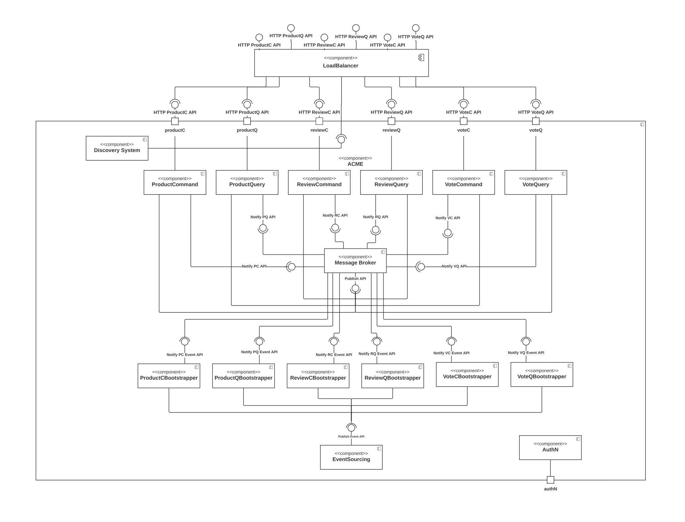

# Project ACME

The objective of the project is to re-engineer the ACME application adopting the approach of a decentralized/distributed system.

This project was developed for evaluation in the Systems Integration course of the Master in Informatics Engineering - Software Engineering at Instituto Superior de Engenharia do Porto - ISEP/IPP

#### Two dimensions of decentralization/distribution are addressed:
- Business Domain Segregation: The monolithic application was segregated into three distinct but collaborative applications:
    - Products
    - Reviews
    - Votes

- Cloning: Multiple instances of each of the above applications are deployed in containers.

 

## Requirements

### Non-functional requirements
- Deployment must be automated through CI/CD.
- Adoption of service component test pattern.
- Adoption of end-to-end test pattern.
- Two or more frameworks/programming languages must be adopted in implementing the services.
- AMQP Message Broker (e.g. RabbitMQ) must be adopted for communication between services.

 

### Functional requirements
- Endpoint in service Votes that allows creating a vote for a non-existing review. The review must be created for the specified product, and the vote is eventually associated with the review.

- Develop a bootstrap process for the starting services. I.e. at any time, a new service can start and its data must be bootstrapped.

 

### _The following patterns must be adopted_:
- Strangler fig
- Command-Query Responsibility Segregation (CQRS)
- Database-per-Service
- Polyglot persistence
- Messaging (RabbitMQ - AMQP Message Broker)
- The Domain Events
- Event Sourcing
- Saga
- CI (Continuous Integration)

 

## Tools

- Docker
- RabbitMQ
- H2
- MongoDB
- Axon Server
- Eureka (Netflix)
- Git/GitHub
- GitHub Actions (CI)

 

## Programming Language

- Java (JDK 17)
- Node.js

 

## Features

- Load Balance
- Discovery System
- Message Broker (RabbitMQ)
- Bootstrapper
- Product, Review e Vote (Command/Query)

 

# Documentation
## Logic View

## Physical View

## Sequence Diagrams
### Case 01 POST Product

 

### Case 02 POST Review

 

### Case 03 POST Vote

 

### Case 04 SAGA
.svg)
 

 

## Students
|  |  |  |
| :-: | :-: | :-: |
| *David Gomes* | *Regiana Cruz* | *Nairon Carneiro* |

## Professor
|  |
| :-: |
| *Nuno Silva* |
